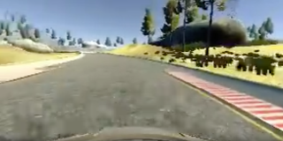
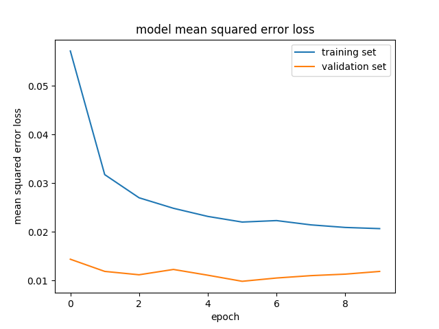
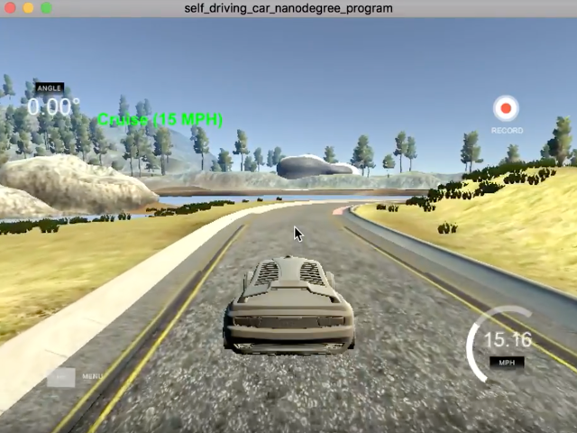

# Behavioral Cloning Project P3

# TODO add L/C/R and flipped/bright/shadow

This project was developed to fulfill Project 3 (Term 1) of the Udacity Self-Driving Car Engineer Nanodegree Program

The goals / steps of this project are the following:
* Use the simulator to collect data of good driving behavior
* Build, a convolution neural network in Keras that predicts steering angles from images
* Train and validate the model with a training and validation set
* Test that the model successfully drives around track one without leaving the road
* Summarize the results with a written report

## Result

|Screen Capture|
|:--------:|
|[|
[Link to YouTube Video](https://youtu.be/m50T1rnkuOg)

## Rubric Points
This project is submitted after considering the rubric published [here](https://review.udacity.com/#!/rubrics/432/view).

---
## Submission

My project includes the following files:
* model.py containing the script to create and train the model
* drive.py for driving the car in autonomous mode
* model.h5 containing a trained convolution neural network
* writeup_report.md summarizing the results

## Data Pipeline

The model.py file contains the code for preprocessing images, augmenting the data, training the model and saving the convolution neural network. The preprocessing steps and model description are described as follows.

  * Data collection
    After the collection process, I had X number of data points. I then preprocessed this data by ...
  * Data Preprocessing Steps
    1.  datasets are provided
    2.  data are read from driving_log.csv for datasets
    3.  observations with little or no throttle are discarded
    4.  paths for left/center/right camera images are rewritten to use relative paths, for easy porting to Amazon AWS
    5.  observations with straight steering angles are under-sampled by 20%
    6. observations with significant left or right steering angles are oversampled through duplication. Jitter is applied to the copy by perturbing the angles slightly
    7. data collected in problem areas (turns, bridge) are oversampled by repeating each 4 times
    8. final observation set is shuffled

  * Data is subdivided; 80% is retained for training and 20% is retained for validation. Data is not split for testing purposes as the tests will be conducted interactively in the simulator provided
  * Augmenting The Training Data
  A generator is used to extract batches of samples used in model training. The steps followed to build each batch are:
    1. The full set of training samples are shuffled
    2. A left camera, right camera, or center camera image is selected randomly to represent each observation in the batch. Left and right images are joined by a +/- adjustment 0.2 to the steering angle, respectively. Center images are provided with the unchanged steering angle.
    3. The selected image is flipped and then added to the batch, with probability of addition of 0.90. The steering angle is negated and added along with the flipped image.
    4.  A copy of the the image is brightened and added to the batch, along with the associated steering angle.
    5. A synthetic shadow is added to a copy of the image, by randomly choosing a bisection line across the image and darkening the image under one side. The shadow image is added to the batch with 0.80 probability.
    6. The batch is shuffled

  * Augmenting The Validation Data
    1. The full set of validation samples are shuffled
    2. The center camera image is selected to represent an observation. The image is provided with the steering angle and added to the batch.
    3. The batch is shuffled

  * The training model architecture is shown here:


### Model Architecture and Training Strategy

1. Model architecture employed

My model consists of a convolution neural network with 5x5 and 3x3 filter sizes and depths between 24 and 64. (model.py lines 238-252). The model used is the NVIDIA model suggested in the course materials and more fully described [here](https://images.nvidia.com/content/tegra/automotive/images/2016/solutions/pdf/end-to-end-dl-using-px.pdf).

The model includes ELU layers to introduce nonlinearity and increase training performance. The data is normalized in the model using a Keras lambda layer (code line 239).

The model contain a dropout layers in order to reduce overfitting (model.py lines 247). In addition, the number of epochs was reduced to 10 prevent overfitting.

The model was trained and validated on different data sets to ensure that the model was not overfitting (code lines 227-228 and line 256). The model was tested by running it through the simulator and ensuring that the vehicle could stay on the track.

The model used an adam optimizer, with the learning rate tuned to 1.0e-4 (model.py line 252).

Training data was chosen to keep the vehicle driving on the road. I used a combination of:
  * center lane driving data provided with the project description
  * center lane driving data captured by me, for driving in both directions around the track
  multiple captures of recovering from the left and right sides of the road
  * multiple passes of driving through the difficult areas, namely turns and the bridge area. These areas became evident as the car would leave the road in early trials.

For details about how I created the training data, see the next section.

The model used can be summarized as follows:

```
  ________________________________________________________________________________________
  Layer (type)                     Output Shape          Param #     Connected to                     
  ========================================================================================
  lambda_1 (Lambda)                (None, 160, 320, 3)   0           lambda_input_1[0][0]
  ________________________________________________________________________________________
  cropping2d_1 (Cropping2D)        (None, 75, 320, 3)    0           lambda_1[0][0]       
  ________________________________________________________________________________________
  convolution2d_1 (Convolution2D)  (None, 36, 158, 24)   1824        cropping2d_1[0][0]
  ________________________________________________________________________________________
  convolution2d_2 (Convolution2D)  (None, 16, 77, 36)    21636       convolution2d_1[0][0]
  ________________________________________________________________________________________
  convolution2d_3 (Convolution2D)  (None, 6, 37, 48)     43248       convolution2d_2[0][0]            
  ________________________________________________________________________________________
  convolution2d_4 (Convolution2D)  (None, 4, 35, 64)     27712       convolution2d_3[0][0]            
  ________________________________________________________________________________________
  convolution2d_5 (Convolution2D)  (None, 2, 33, 64)     36928       convolution2d_4[0][0]            
  ________________________________________________________________________________________
  flatten_1 (Flatten)              (None, 4224)          0           convolution2d_5[0][0]            
  _________________________________________________________________________________________
  dropout_1 (Dropout)              (None, 4224)          0           flatten_1[0][0]                  
  _________________________________________________________________________________________
  dense_1 (Dense)                  (None, 100)           422500      dropout_1[0][0]                  
  _________________________________________________________________________________________
  dense_2 (Dense)                  (None, 50)            5050        dense_1[0][0]                    
  _________________________________________________________________________________________
  dense_3 (Dense)                  (None, 10)            510         dense_2[0][0]
  _________________________________________________________________________________________
  dense_4 (Dense)                  (None, 1)             11          dense_3[0][0]                    
```

#### Training the Model

```
____________________________________________________________________________________________________
Epoch 1/10
20401/20224 [==============================] - 261s - loss: 0.0572 - val_loss: 0.0143
Epoch 2/10
20335/20224 [==============================] - 257s - loss: 0.0318 - val_loss: 0.0118
Epoch 3/10
20335/20224 [==============================] - 428s - loss: 0.0270 - val_loss: 0.0111
Epoch 4/10
20376/20224 [==============================] - 239s - loss: 0.0248 - val_loss: 0.0122
Epoch 5/10
20393/20224 [==============================] - 244s - loss: 0.0232 - val_loss: 0.0111
Epoch 6/10
20336/20224 [==============================] - 25780s - loss: 0.0220 - val_loss: 0.0098
Epoch 7/10
20385/20224 [==============================] - 461s - loss: 0.0223 - val_loss: 0.0105
Epoch 8/10
20431/20224 [==============================] - 266s - loss: 0.0214 - val_loss: 0.0110
Epoch 9/10
20350/20224 [==============================] - 273s - loss: 0.0209 - val_loss: 0.0113
Epoch 10/10
20343/20224 [==============================] - 273s - loss: 0.0206 - val_loss: 0.0118

* note that my laptop went to sleep during epoch 6 (overnight!)

```

#### Training Loss

The training and validation loss calculated after each epoch are pl0tted as follows:



Earlier in the process, when using less training data,I concluded that 10 epochs were sufficient. While still sufficient, a more recent run shows the number of epochs could be further reduced to 6.

#### Creation of the Training Set & Training Process

To capture good driving behavior, I first attempted to record two laps on the lake track using center lane driving. I found this hard to do with the keyboard or mouse controls.

Since I found this difficult to do, I decided to modify the simulator so that I could capture training data with a gamepad controller. Due to immediate availability, I selected the Logitech F310.

Once I established connectivity from the usb controller, I modified the simulator to map these inputs from the gamepad:


| Control        | Function |
| ------------- |:-------------:|
| Left Stick (up/down)     | Throttle  |
| Right Stick (left/right)     | Steering |
| DPad (up/down)| Adjust max cruise speed|
| X Button (blue) | Save this position    |
| Y Button (yellow) | Teleport to saved location |
| A Button (green) | cruise on/off |
| B Button (red) | toggle recording |

Once I enabled these improvements, the control was much better. As I was still debugging the model and running off the road, I enlisted the help of a 'stunt driver'. I asked my son to record a session since he's much more practiced with a gamepad!

Here is an example of the modded sim in action:

|Capturing Training Data|
|:--------:|
|[]|
[Link to YouTube Video](https://youtu.be/3y3MOZyYXRQ)


I used this training data for training the model. The validation set helped determine if the model was over or under fitting. The ideal number of epochs was Z as evidenced by ... I used an adam optimizer so that manually training the learning rate wasn't necessary.

## Testing

The project was tested using the Udacity-provided simulator and the provided drive.py file. The car can be driven autonomously around the track by executing
```sh
python drive.py model.h5
```
The final step was to run the simulator to see how well the car was driving around track one. At the end of the process, the vehicle is able to drive autonomously around the track without leaving the road.

A video of a test run in the simulator is provided at the very top of this report.

The jungle course was attempted with the final model, however, it was found that this model would not generalize to work on the jungle track. Clearly, more data, a better model, and/or augmentation would be required.

## Resources Used and/or Consulted

* [Paul Heraty's Behavioral Cloning Cheatsheet](https://slack-files.com/T2HQV035L-F50B85JSX-7d8737aeeb)
* [Learning human driving behavior using NVIDIA’s neural network model and image augmentation.](https://chatbotslife.com/learning-human-driving-behavior-using-nvidias-neural-network-model-and-image-augmentation-80399360efee)
* [Exponential Linear Units (ELU) for Deep Network Learning]( https://www.linkedin.com/pulse/exponential-linear-units-elu-deep-network-learning-martin-heusel)
* [Amazon Web Services (AWS EC2)](http://aws.amazon.com)
* https://github.com/priya-dwivedi/CarND
* https://github.com/ericlavigne/CarND-Behavioral-Cloning
* https://github.com/naokishibuya/car-behavioral-cloning
* [Python 3.6.3 Documentation](https://docs.python.org/3/)
* [Keras Documentation](https://keras.io)
